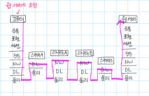
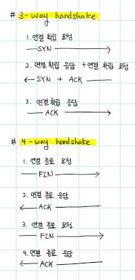

# 네트워크

| 순서 | 날짜     | 제목                                                |
| ---- | -------- | --------------------------------------------------- |
| 1    | 21/07/09 | [1, 2장 네트워크와 모델](1,-2장-네트워크와-모델.md) |
| 2    | 21/07/10 | [3장-L2-이더넷](3장-L2-이더넷.md)                   |
| 3    | 21/07/12 | [4장-L3-IP-주소](4장-L3-IP-주소.md)                 |
|      |          |                                                     |
|      |          |                                                     |
|      |          |                                                     |
|      |          |                                                     |
|      |          |                                                     |
|      |          |                                                     |
|      |          |                                                     |

# Network & Web

# Web

1. AJAX란 무엇이며 왜 사용하는지 설명하시오
   - 비동기 통신을 위한 JavaScript 라이브러리 입니다.
   - **A**synchronous **J**avascript **A**nd **X**ml(비동기식 자바스크립트와 xml)
   - 비동기 통신, 클라이언트와 서버간에 XML 데이터를 주고받는 기술

2. GET 방식과 POST 방식의 차이점을 설명하시오.

    GET 메소드는 데이터를 요청할 때 사용하며, url 파라미터에 데이터를 담아보내기 때문에 HTTP message에 body가 없다.

    POST 메소드는 서버의 리소스를 새로 생성 / 업데이트 할 때 사용하며, body에 데이터를 담아 보내 HTTP message에 body가 존재한다. GET보다 처리 속도는 느리지만 데이터가 노출되지 않는다.

3. PATCH와 PUT의 차이점을 설명하시오.

    둘 다 리소스를 업데이트 한다는 점은 동일하나, PUT은 리소스 모든 것을 업데이트 하지만 PATCH는 일부를 업데이트한다.

4. REST란 무엇이고, RESTful하게 API를 디자인한다는 것은 무엇인지 설명하시오.

   - Restful하게 API를 디자인한다는 것은 URI를 규칙에 맞게 잘 설계했는지의 여부

     1. 동일한 URI(End point)의 행위에 맞게 POST, GET, DELETE, PATCH등의 메소드를 사용한다.
     2. 명사를 사용한다. 리스트를 표현할 때는 복수형을 사용한다.
     3. URI Path에 불필요한 파라미터를 넣지 않는다. 즉, 단계를 심플하게 설계한다.

5. HTTP의 비연결성과 비상태성이란?

   1. **비연결성(Connectionless)**

      서버는 request를 보낸 클라이언트에 response를 보낸 후 연결을 끊는다.

   2. **비상태성(Stateless)**

      클라이언트와 서버가 통신으로 데이터를 주고받아도 두번째 통신에서는 이전 데이터를 유지하지 않는다.

   3. 장점

      리소스 낭비가 줄어든다.

   4. 단점

      현재 접속자가 이전 사용자와 같은 사용자인지 알 수 있는 방법이 없다. 클라이언트는 매 요청마다 인증을 해야 한다.

6. 쿠키
   - 특정 웹서버에 접속할 때 생성되는 개인 아이디, 비밀번호 등 방문 사이트 정보를 담은 임시 파일
   - 클라이언트 (브라우저) pc에 저장됨
   - text 형식
   - 이름, 값, 유효 시간, 경로, Secure (https protocol인 경우만 전송), HttpOnly (script로 get 불가 여부)
   - 서버에 요청 (request GET, POST) 할 때 Cookie를 넘겨준다.
   - 만료 시점이 지나야 삭제됨
   - 세션보다 빠름
   - 보안성이 떨어진다.
   - 사용 목적 : 세션 관리, 개인화, 트래킹

7. 세션

   - 클라이언트 - 웹 서버 간 네트워크 연결이 지속적으로 유지되고 있는 상태
   - 웹 서버 저장됨
   - object 형식
   - 브라우저 종료 시 삭제
   - 쿠키보다 느림
   - 쿠키보다 보안성이 좋고 주로 로그인 정보 유지에 사용된다.

8. 세션/쿠키 방식 단점

   1. 메모리 부족하거나 서버가 재부팅되면 날아간다. (휘발성)

   2. Session ID를 모든 서버에서 이용할 수 있도록 하기엔, 중앙 세션 저장소가 없다면 어려워 확장이 어렵다.

      이 세션을 redis같은 MemCached같은 메모리형 데이터베이스 서버에 저장하기도 한다.

9. JWT (Json Web Token / 인가 토큰 방식)

   사용자가 로그인 하면 토큰을 생성해서 클라이언트로 넘겨준다. 서버가 토큰을 기억하고 있지 않다.

   인코딩, 암호화된 3가지 정보를 이어붙인다. xxx.yyy.zzz

   구조 : header, payload, verify signature(서명)

10. HTTP vs WebSocket

    - **HTTP**는

         - 유저가 request를 보내야 서버가 response로 응답할 수 있다.

         - HTTP는 `stateless`다. 서버는 response를 보내면 전에 받았던 request를 잊어버린다.

            서버로 메시지를 보낼 때 클라이언트 정보를 보내려면 (유저 프로필 등) `cookie`를 보내야 한다.

    - **WebSocket**은 `real-time`, `양방향 통신` 프로토콜이다.
      
      - 브라우저가 서버로 WebSocket request를 보낸 후 연결이 성립되면, 양방향 통신이 가능해진다. 서버는 유저에게 request 없이 메시지를 보낼 수 있다. (real-time으로 계속 연결되어 있다.)

11. 웹 서버와 WAS란

       웹 서버는 웹 브라우저 같은 클라이언트로부터 HTTP 요청을 받아 HTML과 같은 웹 페이지를 전송해주며 정적 문서만 처리한다. Apache Server, Nginx 등이 있다.

       WAS (Web Application Server는) 동적 컨텐츠 까지 제공한다. (WAS = Web Server + Web Container)

12. 웹 브라우저에 구글을 입력하면 일어나는 일

13. DNS의 뜻과 사용하는 프로토콜

      DNS는 도메인을 인터넷 주소인 IP로 바꾸며 신뢰성 보다는 속도가 중요하기에 UDP를 사용한다.

14. HTTP와 HTTPS

      - HTTP(Hypertext Transfer Protocol) + SSL(Secure Socket Layer) = HTTPS(Hypertext Transfer Protocol Secure)
      - HTTPS는 HTTP를 안전하게 만드는 방식이다.
        - HTTPS 프로토콜은 전송되는 데이터를 암호화해서 보냄으로써, 데이터 노출의 안전이 보장된다.
      - HTTPS는 TCP 계층 위에 SSL 또는 TLS 보안계층이 추가된다.

15. HTTPS의 암호화 방식

     공개키 암호화 방식과, 공개키의 느리다는 단점을 보완한 대칭키 암호화 방식을 함께 사용한다.

     공개키 방식으로 대칭키를 전달하고, 서로 공유된 대칭키를 가지고 통신한다.

16. SSL/TLS 인증 과정을 비대칭 알고리즘과 관련지어서

     1. 인터넷 사이트 (서버)는 공개키와 개인키를 만들고, 신뢰할 수 있는 인증기관 (CA)에 자신의 정보와 공개키를 관리해 달라고 계약한다.
     2. 인증 기관은 기관만의 공개키와 개인키가 있다. 인증 기관은 사이트가 제출한 데이터를 검증하고, 인증 기관의 <u>개인키로 사이트 정보를 암호화해서 인증서</u>를 만들어 제공한다. 사이트는 인증서를 가지게 되었다.
     3. 인증기관은 <u>웹 브라우저에게 인증기관의 공개키</u>를 제공한다.
     4. 사용자가 사이트에 접속하면 서버는 자신의 인증서를 웹 브라우저(클라이언트)에 보낸다.
     5. 웹 브라우저는 3에서 알고 있던 인증기관의 공개키로 인증서를 해독하여 검증한다. 그러면 사이트의 정보와 서버의 공개키를 알 수 있게 된다. (보안상의 의미는 없지만 해당 서버로부터 온 응답임을 확신하는 과정)
     6. 5에서 얻은 서버의 공개키로 대칭키를 암호화해서 다시 사이트로 보낸다.
     7. 사이트는 개인의 암호문을 해독해 대칭키를 얻게 되고, 이제 대칭키로 데이터를 주고받을 수 있게 된다.

# Network

#### ◼ OSI 7계층

~

1. 물리 : 데이터를 전기적 신호로 변환하여 전송
2. 데이터링크 :같은 LAN선 안에서 MAC 주소로 통신, 오류 제어, 흐름 제어
3. 네트워크 : 라우팅, 다른 LAN선에 있는 컴퓨터에 라우팅을 통해 IP 주소로 통신한다.
4. 전송 
   1. 목적지에 **신뢰**할 수 있는 데이터 전달
   2. **오류** 점검 : 오류 발생 시 재전송 요청
   3. 전송된 데이터의 목적지가 어떤 어플리케이션인지 식별 (**host간** 전송)
   4. 전송 계층 구분
      - TCP (Transmission Control Protocol) : 신뢰성, 연결형 
      - UDP (User Datagram Protocol) : 비신뢰성, 비연결형, 효율성, 실시간
5. 세션 : 논리적 연결 유지 & 해제
6. 표현 
7. 응용

### ◼ TCP/IP

응용, 전송, 인터넷, 네트워크 접속 계층
- `OSI7`는 **역할 기반**으로, 통신 전반에 대한 표준
- `TCP/IP`는 **프로토콜 기반**으로, 데이터 전송 기술 특화

 

### ◼ OSI 7 Lauer vs TCP/IP Protocol Suite
1. TCP/IP가 먼저 개발되고, 인터넷 개발 이후 계속 표준화된 반면 OSI 7는 표준이 되기는 하지만 실제로 잘 구현되지는 않는다.
2. OSI 7은 장비, 통신을 어떻게 표준으로 잡을지 사용하고 TCP/IP는 실제 통신에 사용된다.
3. TCP/IP : **Application** (OSI의 Application, Presentation, Session) | **Transport** | **Internet** (OSI의 NW) | **Network Access** 

 

### ◼ 프로토콜

1. 가까운 곳과 연락할 때는 - `MAC 주소`로 - `Ethernet` 프로토콜
2. 멀리 있는 곳과 연락할 때는 - `IP 주소`로 - `ICMP`, `IPv4`, `ARP`
3. 여러가지 프로그램으로 연락할 때 - `포트번호`로 - `TCP`, `UDP`

### 패킷

- 실제 통신은 여러 프로토콜이 `캡슐화`된 `패킷` 단위로 이루어진다.
- Ethernet - IPv4 - TCP - 데이터
- 데이터를 -> 어떤 프로그램으로 (TCP) -> 어느 지역으로 (IPv4) -> 어떤 특정 컴퓨터에게 (Ethernet)
- 패킷은 제어정보인 `헤더`와 사용자 데이터인 `페이로드`로 구성되어 있다.

##### ◼ 캡슐화와 역캡슐화란?

- 캡슐화 : 응용 계층부터 물리 계층까지, 계층별로 데이터를 전달할 때 헤더를 붙이는 것
- 역캡슐화 : 데이터 수신 측에서 물리 계층부터 응용 계층까지 계층별로 데이터를 전달할 때 헤더를 제거하는 것

 

## L1 물리 계층

- 리피터 : 네트워크 중계 장비
- 허브 (=리피터 허브) : 전기 신호 정형, 증폭
- 리피터와 허브는 받은 데이터를 보내는 대상 뿐만 아니라 모든 포트에 전송

## L2 데이터 링크 계층

### Ethernet

- 랜에서 데이터를 주고받는 규칙, 
- EtherNet Header는 14바이트로 구성되어 있다.
  1. 목적지 주소 : 데이터를 전달받을 상대방 MAC주소 6바이트
  2. 출발지 주소 : 데이터 전달하는 시스템의 MAC주소 6바이트
  3. 상위 프로토콜 타입 : 2바이트 (3계층의 IPv4(0x0800), ARP(0x0806))

### CSMA/CD

- 데이터 충돌 : 허브는 들어온 데이터를 그대로 모든 포트에 보내기만 하기 때문에, 컴퓨터 여러 대가 동시에 데이터를 보내면 데이터 끼리 충돌이 발생할 수 있다. 이더넷은 데이터 충돌을 막기 위해 CSMA/CD 방식을 사용한다.
- CS : 데이터를 보내려고 하는 컴퓨터가 케이블에 신호가 흐르고 있는지 확인하는 규칙
- MA : 케이블에 데이터가 흐르고 있지 않으면 데이터를 보내도 되는 규칙
- CD : 충돌이 발생하고 있는지 확인하는 규칙

 

### MAC 주소

## L3 네트워크 계층

### 3계층 프로토콜

- `ARP` : IP 주소로 MAC 주소를 알아온다.
- `IPv4` : WAN에서 통신할 때 사용
- `ICMP` : 서로가 통신되는지 확인

##### ◼ IP 헤더와 IP 패킷 

- IP 헤더 : 출발지 IP 주소, 목적지 IP 주소 등
- IP 패킷 : IP 프로토콜을 사용해 캡슐화 할 때 데이터에 IP 헤더가 추가된 것 cf) 2계층 - 프레임

##### ◼ IP 주소의 구조

- IPv4 (32) 주소 고갈 문제를 위해 IPv6 (128)과 혼용하여 사용, 공인/사설 IP 나누어 할당
  - <u>공인 IP</u> : 라우터에 ISP (인터넷 서비스 제공자)가 제공
  - <u>사설 IP</u> : 랜 안에 있는 컴퓨터에 랜의 네트워크 관리자가 할당 or DHCP로 자동 할당
- cf> MAC 주소 (48) 16진수, IP 주소 (32) 10진수로 표기
  - IP주소를 32개의 2진수 (비트)로 표기할 때 8개씩 나눠서 표기 -> 옥텟 (octet)
- IP 주소는 네트워크 ID와 호스트 ID로 나뉜다.
  - <u>네트워크 ID</u> : 어떤 네트워크인지
  - <u>호스트 ID</u> : 해당 네트워크의 어느 컴퓨터인지

##### ◼ IP 주소의 클래스 구조

- IPv4는 32비트인데 네트워크 ID를 조절하여 쓸 수 있고 네트워크 크기를 클래스라는 개념으로 구분한다.
- 클래스별로 공인 IP, 사설 IP로 사용할 수 있는 주소가 분리되어 정해져 있다.
- A 클래스 : 대규모, **네트워크 ID 8** + 호스트 24 
- B 클래스 : 중형, **네트워크 ID 16** + 호스트 16
- C 클래스 : 소규모, **네트워크 ID 24** + 호스트 7
- D클래스 : multicast 주소
- E 클래스 : 연구 및 특수용도 주소

### ◼ NAT

- 사설 IP에서 다른 NW 대역과 통신하려면 같은 공인 IP 주소로 변환되어 통신된다. -> `NAT` 사용
  - `NAT (Network Address Translation)` : 특정 IP를 특정 IP로 바꾸어 주는 것
  - 외부로 나갈 때 `NAT Table`에 해당 사설 IP를 기록하고, 외부 NW에서 응답이 오면 기록을 보고 해당하는 사설 IP로 데이터를 전달한다.
- 외부에서 내부로 직접 통신하려면 `포트포워딩` 설정을 통해서만 가능하다.

 

##### ◼ 네트워크 주소와 브로드캐스트 주소

1. **네트워크 주소** : 호스트ID가 모두 0인 주소 ex) 192.168.1. | 0
   - 전체 네트워크의 대표 주소
2. **브로드캐스트 주소** : 호스트ID가 모두 이진수로 1인 주소 ex) 192.168.1. | 255
   - 네트워크 내의 컴퓨터, 장비에게 한 번에 데이터 전송

##### ◼ 서브넷 구조

- 서브네팅 : 호스트 ID로 사용되던 비트를 서브넷 ID로 바꾸어 작은 네트워크로 분할한다.
- 서브넷 마스크 : `네트워크ID+서브넷ID`와 `호스트ID 식별`
  - A클래스 : 255.0.0.0
  - B클래스 : 255.255.0.0
  - C클래스 : 255.255.255.0
- prefix 표기법 : 서브넷 마스크를 `슬래시(/비트수)`로 나타냄.
- ex) <u>C클래스에서 4bit 서브네팅</u>
  - 원래 C클래스는 네트워크ID 24 + 호스트ID 8
  - 네트워크ID를 28bit로 변경한다. -> 호스트ID에서 4bit를 빌려 서브넷ID로 사용한다. -> NW24 + subnet 4 + host4
  - 서브넷마스크 : 11111111.11111111.11111111.11110000 -> 255.255.255.240 
  - prefix : `/28`

##### ◼ 기본 게이트웨이 (default gateway)

- 다른 네트워크의 컴퓨터의 데이터를 전송할 때 라우터의 IP 주소로 설정하는 네트워크의 출입구
- ex) 192.168.1.0/24 에 속한 컴퓨터가 다른 네트워크로 전송 시 192.168.1.1 (라우터 IP 주소)로 전송

##### ◼ 라우팅 

- 경로 정보를 기반으로 다른 네트워크까지 최적의 경로로 데이터를 전송하는 방식
- 라우팅 테이블 : 라우팅에 사용되는 경로 정보가 저장되어 있는 곳
- 라우팅 프로토콜 (ex. RIP, OSPF, BFP) : 라우터 간 라우팅 정보를 서로 교환하는 프로토콜

 

## L4 전송 계층

##### ◼ TCP의 구조

- `세그먼트` : TCP 헤더가 붙은 데이터
- TCP 헤더 : TCP로 전송할 때 붙이는 헤더
  - 출발지 포트 번호(16), 목적지 포트 번호(16), 일련번호(32), 확인 응답 번호(32), 코드 비트(6), 윈도우 크기(16),  체크섬(16) 등
    - 포트 번호 : 데이터 목적지가 어떤 어플리케이션인지 구분
      - 0~1023 : well-kwon ports(서버 측 어플리케이션)
      - 1024 : 예약 (사용x) 
      - 1025~ : 랜덤 포트 (클라이언트 송신 포트)  
    - 코드 비트 : SYN, ACK, FIN, 초기화 0, 활성화 1, 데이터 전송 전 연결 성립과 해제를 위해
    - 세그먼트(데이터) 하나를 보낼 때 마다 반환되는 일련번호, 확인 응답 번호를 통해 재전송 제어
      - 일련번호 : <u>송신측에서</u> 수신측에 이 데이터가 몇 번째 데이터인지 알려준다. 
      - 확인 응답 번호 : <u>수신측이</u> 송신 측에 몇 번째 데이터를 수신했는지 알려준다.
    - 윈도우 크기 : 세그먼트를 버퍼에 저장하며 연속해서 보내고 확인 응답을 반환한다. 이때 버퍼의 한계 크기가 윈도우 크키고 버퍼가 넘치면 overflow가 발생한다. 
  - TCP 헤더는 목적지까지 데이터를 제대로 전송하기 위해 필요한 정보를 가지고 있다.
- TCP가 데이터를 전송하려면 `연결(connection)`이라는 가상의 독점 통신로를 확보한 후 데이터를 전송한다.

##### ◼ `TCP 3 way handshake` - 연결(connection) 성립 : TCP의 정확한 전송 보장을 위해, SYN과 ACK로 연결을 확립한 후 전송한다.

1. 클라이언트가 서버에게 접속을 요청하는 `SYN` 패킷 보낸다. 클라이언트는 응답을 기다린다.
2. 서버가 `SYN` 요청을 받고 요청을 수락한다는 `ACK`와 `SYN`을 보내 클라이언트가 응답하길 기다린다.
3. 클라이언트가 `ACK`를 보내고 연결이 이루어져 데이터가 오간다. 

##### ◼ `TCP 4 way handshake` - 연결 해제

   1. 클라이언트가 연결을 종료하겠다는`FIN` 플래그 전송
   2. 서버가 `FIN`을 받고 확인했다는 `ACK` 클라이언트를 보낸다. 이때 모든 데이터를 보내기 위해 `TIME OUT` 상태가 된다.
   3. 데이터를 모두 보냈다면 연결이 종료되었다는 `FIN`을 클라이언트에게 보낸다.
   4. 클라이언트가 `FIN`을 받고 확인했다는 `ACK`를 보낸다. 아직 서버로부터 받지 못한 데이터가 있을 수 있으므로 클라이언트는 `TIME WAIT`
   5. 서버는 `ACK`를 받은 후 소켓을 닫는다. (`Closed`)
   6. `TIME WAIT` 시간이 끝나면 클라이언트도 닫늗다. (`Closed`)

   

##### ◼ TCP 흐름제어

​	흐름제어는 데이터를 송신하는 곳과 수신하는 곳의 데이터 처리 속도를 조절하여 수신자의 버퍼 오버플로우를 방지한다. 슬라이싱 윈도우 기법을 사용한다.

##### ◼ TCP 혼잡제어

​	혼잡제어는 네트워크 내의 패킷 수가 증가하지 않도록 방지한다.

 

##### ◼ UDP의 구조

- UDP 데이터 그램 : UDP 헤더가 붙은 데이터
- UDP 헤더 : 출발지 포트 번호 (16), 목적지 포트 번호 (16), 길이(16), 체크섬(16)

##### ◼ 브로드캐스트 : UDP는 상대방을 확인x 연속해서 데이터를 보내기 때문에 브로드 캐스트 가능, 랜에 있는 컴퓨터나 네트워크 장비에 데이터를 일괄로 보낸다.

 

##### ◼ 애플리케이션과 포트 번호

- 22 SSH, 25 SMTP, 53 DNS, 80 HTTP, 110 POP3, 443 HTTPS

 

## L7 응용 계층

### ◼ HTTP란?

클라이언트 (웹브라우저)가 웹 사이트를 보기 위해 서버의 80번 포트를 이용하여 HTTP 요청을 보내고 HTTP 응답을 받는다.

### ◼ keepalive 기능이란?

HTTP/1.1 버전은 keepalive 기능이 있어 데이터를 교환하는 동안에는 연결을 유지하고 데이터 교환이 끝나면 연결을 끊는다.

요청 순서대로 응답을 반환한 후 마지막에 연결을 끊기 때문에, 이전 요청을 처리하는 데 시간이 길어지만 다음 요청에 대한 처리가 늦어진다.

### ◼ HTTP/2

요청을 보낸 순서대로 응답을 반환해도 되지 않기 때문에 콘텐츠를 빠르게 표시할 수 있다.

##### ◼ HTTP와 HTTPS의 차이 : 백엔드에서 프론트로 데이터를 전송할 때 데이터 암호화의 유무이다.

- 암호화 방식은 SSL 인증서다.

 

### ◼ URL

- `www.test.co.kr` 의 경우 `www`는 호스트 이름, `test.co.kr`은 도메인 이름이다.

### DNS 서버

DNS는 URL을 IP 주소로 변환해주며, DNS 서버가 웹 사이브 서버의 IP 주소를 알려준다. -> 이름 해석 (name resolution)

1. 컴퓨터에서 도메인의 IP 주소를 요청
2. DNS 서버가 해당 요청에 해당하는 도메인 이름의 IP 주소를 반환
3. 컴퓨너는 IP주소로 서버에 접속
4. 요청한 첫 번째 DNS 서버가 도메인의 IP 주소를 모르는 경우 다음 DNS 서버에 요청한다.

 

### ◼ FTP (File Transfer Protocol)

- 서버와 클라이언트 간 파일 전송 프로토콜
- 통신 포트 : 제어용 21번, 데이터 전송용 20번

 

### ◼ 메일 서버 (SMTP와 POP3)

메일 송신은 SMTP (25), 수신은 POP3(110)

1. 컴퓨터1이 SMTP를 사용하여 메일 서버 (ex. 포털 사이트, 회사의 매일 서버)1로 메일을 보낸다. - 메일 서버의 호스트 이름 (서버 이름) 설정
2. SMTP를 사용해 메일 서버 1에서 메일 서버 2로 메일을 보낸다.
3. POP3를 사용해 메일 서버 2에서 컴퓨터 2로 메일 데이터를 보낸다.

### ◼ POP3

메일 박스 : 메일 서버에 있는 메일을 보관하는 기능

