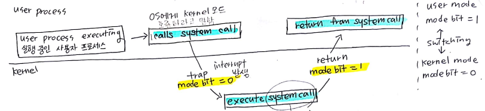

## 운영체제의 3가지 인터페이스

1. CLI
2. GUI
3. Batch Interface

## System Call & User Process & Kernal

- 운영체제는 커널 모드와 사용자 모드로 나누어 구동된다.
- Kernal Mode = Supervisor Mode = Privileged Mode = System Mode
- 어떤 명령어들은 커널 모드에서만 실행될 수 있다.
- 시스템 콜은 커널 영역의 기능을 사용자 모드에서 사용 가능하게, 즉 프로세스가 하드웨어에 직접 접근해서 필요한 기능을 사용할 수 있도록 해준다.

### 순서

1. 시스템이 부팅되면서 하드웨어는 커널 모드에서 시작된다.
2. 운영체제가 load되고 user application을 사용자 모드에서 시작시킨다.
3. trap 혹은 interrupt가 발생할 때마다, 하드웨어는 사용자 보드에서 커널 모드로 바뀐다. (mode bit=0)
4. 운영체제가 컴퓨터에 대한 제어권(control)을 갖게 되면 커널 모드다.
5. 시스템은 유저모드로 제어권(control)을 넘기기 전 마다 유저 모드로 바뀐다.