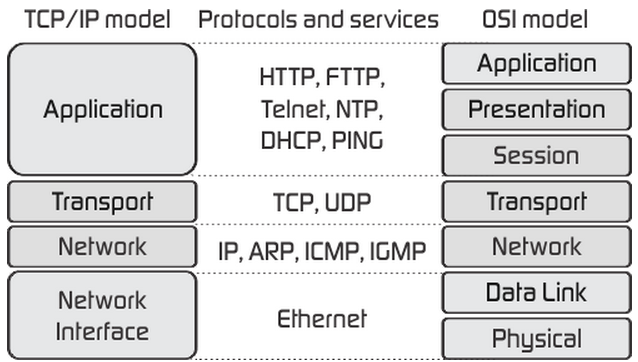
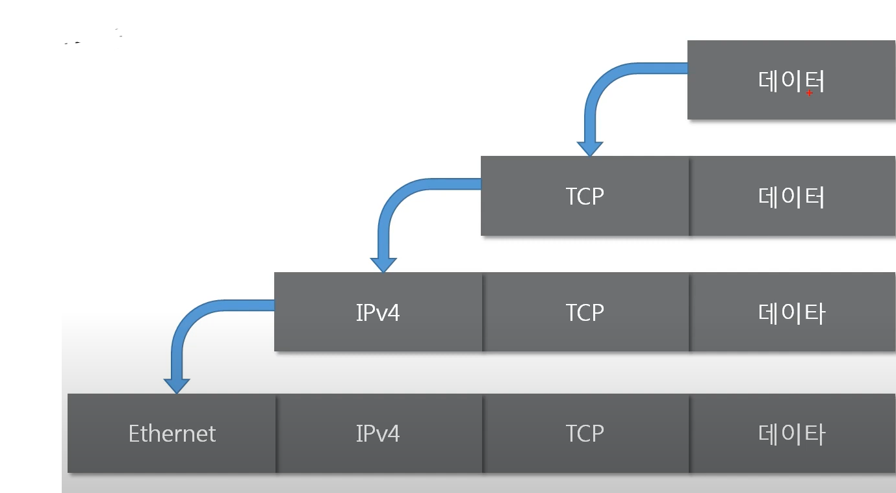
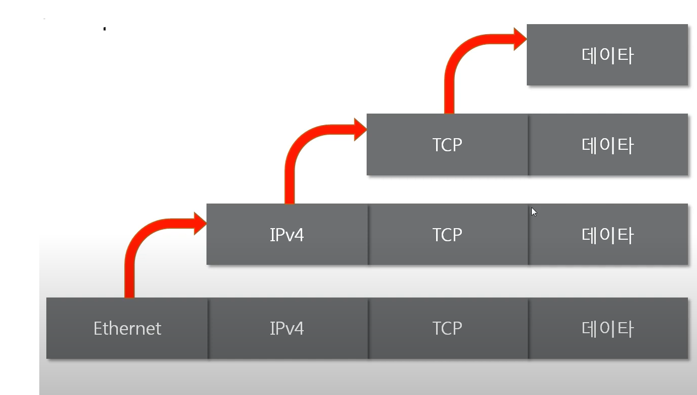
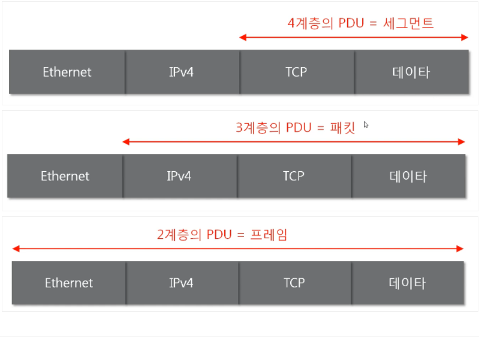

# [1. 네트워크](https://www.youtube.com/watch?v=Av9UFzl_wis&list=PL0d8NnikouEWcF1jJueLdjRIC4HsUlULi&ab_channel=%EB%94%B0%EB%9D%BC%ED%95%98%EB%A9%B4%EC%84%9C%EB%B0%B0%EC%9A%B0%EB%8A%94IT)

## 1. 네트워크와 인터넷

- `네트워크`는 각 노드 (컴퓨터 혹은 통신 장비)들이 데이터를 공유할 수 있게 해주는 통신망

- `인터넷`은 데이터를 공유하도록 전세계를 연결하는 네트워크

  - `www` (=`web`) 는 인터넷이 아니라, 인터넷 통신망을 통해 웹 데이터를 공유하는 정보 공간

  

## 2. 네트워크 분류

### 네트워크 크기에 따른 분류

1. `LAN (Local Area Network)` : 가까운 지역만을 연결, 같은 네트워크 대역이면 하나의 LAN
2. `MAN (Metropolitan Area Network)`
3. `WAN (Wide Area Network)` : 멀리 있는 지역을 묶은 네트워크로 가까운 지역끼리 묶인 LAN들을 다시 하나로 묶은 

### 네트워크 연결 형태에 따른 분류

- 스타형 : 중앙에 있는 네트워크 장비를 통해 모두 연결된 형태,
  - 특징
    중앙의 장비가 고장나면 모든 시스템들이 통신 불가
    일반적으로 스위치 장비를 통해 2계층, LAN 대역을 구성
- 망형 : 모든 시스템들이 각각 개별적으로 연결됨, 비용이 많이 든다.
  - 특징
    특정 장비가 고장나도 다른 장비끼리 통신하는데 문제 없음
    일반적으로 라우터 장비를 통해 3계층, WAN 대역을 구성
- 버스형 : 하나의 선을 통해 여러 시스템을 연결
- 트리형 : 시스템을 여러 계층으로 나눠서 연결
- 링형 : 인접 시스템을 1:1로 연결
- 혼합형 : 여러 형태를 조합하여 구성한 형태

## 3. 네트워크 통신 방식

1. `UniCast` : 특정 대상과만 1:1로 통신
2. `MultiCast` : 특정 다수와 1:N로 통
3. `BroadCast` : 네트워크 대역에 있는 모든 대상과 통신

## 4. 네트워크 프로토콜

### `프로토콜`

- 프로토콜이란 네트워크에서 노드끼리 통신할 때, 어떤 노드가 어떤 노드에게 어떤 데이터를 어떻게 보내는지 작성하기 위한 약속, 양식이다.
- 각 프로토콜들은 해당 프로토콜만의 양식이 있다.

### 여러 프로토콜

1. 가까운 곳과 연락할 때는 - `MAC 주소`로 - `Ethernet` 프로토콜
2. 멀리 있는 곳과 연락할 때는 - `IP 주소`로 - `ICMP`, `IPv4`, `ARP`
3. 여러가지 프로그램으로 연락할 때 - `포트번호`로 - `TCP`, `UDP`

### 패킷

- 실제 통신은 여러 프로토콜이 `캡슐화`된 `패킷` 단위로 이루어진다.
- Ethernet - IPv4 - TCP - 데이터
- 데이터를 -> 어떤 프로그램으로 (TCP) -> 어느 지역으로 (IPv4) -> 어떤 특정 컴퓨터에게 (Ethernet)

# [2. 네트워크 모델](https://www.youtube.com/watch?list=PL0d8NnikouEWcF1jJueLdjRIC4HsUlULi&v=y9nlT52SAcg&feature=youtu.be&ab_channel=%EB%94%B0%EB%9D%BC%ED%95%98%EB%A9%B4%EC%84%9C%EB%B0%B0%EC%9A%B0%EB%8A%94IT)

## 1. `TCP/IP` 모델과 `OSI7` 모델

공통점

- 두 모델 모두 네트워크 모델로 계층간 역할을 정의한다.

차이점

- `OSI7`는 **역할 기반**으로, 통신 전반에 대한 표준
- `TCP/IP`는 **프로토콜 기반**으로, 데이터 전송 기술 특화

## 2. 패킷

- `패킷`이란, 네트워크 상에서 전달되는 형식화된 데이터 블록이다.

- 누가 누구에게, 어떻게, 어떤 데이터를 보내고, 무엇을 요청하고 어떤 데이터로 응답하는지 등을 나타낸다.

- 패킷은 제어정보인 `헤더`와 사용자 데이터인 `페이로드`로 구성되어 있다.

  - `페이로드` : 프로토콜 상위계층에서 내려온 데이터
  - `풋터`: 추가적 정보 데이터
  
  

### 캡슐화

- 초기 사용자 데이터에 헤더를 붙이고, 그것을 페이로드로 보고 다시 헤더를 붙이는 과정을 통해 패킷이 만들어지며 이를 `캡슐화`라고 부른다. 
- 데이터를 **보낼 때** 상위 계층에서 하위 계층으로 내려가며 캡슐화가 반복된다.

### 디캡슐화

- 패킷을 받았을 때, 프로토콜을 하나씩 확인하며 데이터를 확인하는 과정이 `디캡슐화`다.
- 하위 프로토콜부터 어디서 어떤 데이터를 어떻게 보냈는지 확인한다.

### `PDO`

- 계층별로 다른 패킷의 이름을 `PDO` (`Protocol Data Unit`)이라고 한다.
- 프레임 (2계층) - 패킷(3계층) - 세그먼트(4계층)

| 캡슐화                                                 | 디캡슐화                                                 | PDO                              |
| ------------------------------------------------------ | -------------------------------------------------------- | -------------------------------- |
|  |  |  |

