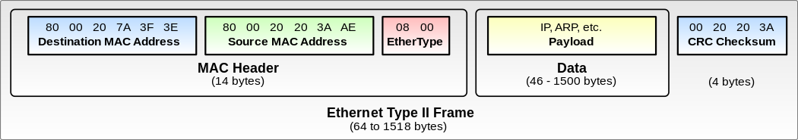

영상: [[따라學IT] 03. 가까이 있는 컴퓨터끼리는 이렇게 데이터를 주고받는다](https://youtu.be/HkiOygWMARs?list=PL0d8NnikouEWcF1jJueLdjRIC4HsUlULi)

# L2 - `Data Link Layer`

## 2계층 하는 일

- 2계층 데이터 링크 계층은, 같은 네트워크 대역 내에서 데이터 전달하며, `오류 제어`와 `흐름 제어`를 한다.
- `오류 제어`란 전달하는 데이터에 오류가 있는지
- `흐름 제어`란 누가 누구에게 전달하는지
- 다른 네트워크 대역과 통신할 때는 3계층 프로토콜이 있어야 한다.

## 2계층에서의 주소

`MAC 주소` (Media Access Address)는 물리적 장비가 보유한 주소다.

- 물리적인 주소, 하드웨어 주소, LAN카드 (=Network Interface Card, NIC)에 부여되어 있는 주소
- 12개의 16진수로 이루어져 있다. (ex) 6C:29:95:04:EB:A1 -> 6byte, 8bit
- 앞의 3바이트는 제조 회사 식별 ID, 뒤의 바이트는 제조사에서 부여한 고유 번호로, 각각의 NIC마다 유일한 주소를 가진다.

## 2계층(Ethernet) 프로토콜

 [출처](https://en.wikipedia.org/wiki/Ethernet_frame)

EtherNet Header는 14바이트로 구성되어 있다.

1. 목적지 주소 : 데이터를 전달받을 상대방 MAC주소 6바이트
2. 출발지 주소 : 데이터 전달하는 시스템의 MAC주소 6바이트
3. 상위 프로토콜 타입 : 2바이트 (3계층의 IPv4(0x0800), ARP(0x0806))