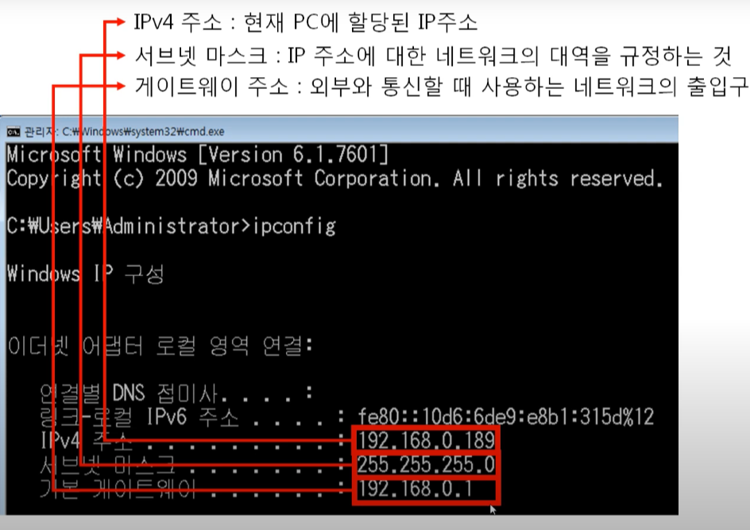

영상: [[따라學IT] 04. 실제로 컴퓨터끼리는 IP주소를 사용해 데이터를 주고받는다](https://youtu.be/s5kIGnaNFvM?list=PL0d8NnikouEWcF1jJueLdjRIC4HsUlULi)

# L3 - `Network Layer`

## 3계층 하는 일

- 서로 다른 네트워크 대역 연결, LAN들을 연결해 WAN을 만든다.

- 3계층 통신을 위해서는 라우터가 필요하다.

  - cf) 2계층 - 스위치

- 3계층 protocol : `ARP`, `IPv4`, `ICMP`

  - `ARP` : IP 주소로 MAC 주소를 알아온다.
  - `IPv4` : WAN에서 통신할 때 사용
  - `ICMP` : 서로가 통신되는지 확인

  

## IP 주소

- 3계층 주소 체계, `Internet Protocol Address Version 4`
- 논리적인 주소
- 32bit, 4byte
- IP 주소 부족 문제 해결 : `Classful IP addr` -> `Classless IP addr` -> `사설 IP`와 `공인IP` -> `IPv6`


### IP 주소 표기 방식

- 10진수로 표기, 각 필드를 `.`으로 구분한다.

- 각 필드에는 `0~255`까지 올 수 있고 1byte로 표현할 수 있는 수다.

- ```
  0.0.0.0 ~ 255.255.255.255
  00000000 . 00000000 . 00000000 . 00000000 ~ 11111111 . 11111111 . 11111111 . 11111111
  ```


## `Classful IP 주소`

N필드는 **네트워크구분**, 나머지는 **호스트**를 구분  

- ex) A 클래스(`0.0.0.0` ~ `127.255.255.255`)는 첫번째 필드만을 네트워크 대역으로 쓰므로, 나머지 세 필드 (3byte)로 컴퓨터 (호스트)를 구분한다. 즉 2^24개의 호스트 구분 가능

| 클래스     | 네트워크 구분             | 시작 주소                                | 마지막 주소                              |
| ---------- | ------------------------- | ---------------------------------------- | ---------------------------------------- |
| `A 클래스` | **0**XXXXXXX, 첫번째 필드 | **0** 0000000.00000000.00000000.00000000 | **0** 1111111.11111111.11111111.11111111 |
|            |                           | **0**.0.0.0                              | 127.255.255.255                          |
| `B 클래스` | **10**XXXXXX, 두번째 필드 | **10** 000000.00000000.00000000.00000000 | **10** 111111.11111111.11111111.11111111 |
|            |                           | **128**.0.0.0                            | 191.255.255.255                          |
| `C 클래스` | **110**XXXXX, 세번째 필드 | **110** 00000.00000000.00000000.00000000 | **110** 11111.11111111.11111111.11111111 |
|            |                           | **192**.0.0.0.                           | 223.255.255.255                          |
| `D 클래스` | 1110XXXX                  | **1110** 0000.00000000.00000000.00000000 | **1110** 1111.11111111.11111111.11111111 |
|            | 멀티클래스                | **224**.0.0.0                            | 239.255.255.255                          |
| `E 클래스` | 11111XXX                  | **1111** 0000.00000000.00000000.00000000 | **1111** 1111.11111111.11111111.11111111 |
|            | 연구용, 예약              | 240.0.0.0                                | 255.255.255.255                          |


## IP 주소 종류

1. `네트워크 ID` : 해당 네트워크 대역 **대표** IP, 해당 네트워크 대역에서 가장 **작은** IP 주소
2. `브로드캐스트 주소` : 해당 네트워크 대역에 모든 시스템에 **통신**할 때 쓰는 IP, 해당 네트워크 대역에서 가장 **큰** IP 주소
3. 호스트 할당 가능한 주소 : 네트워크 ID + 1 ~ 브로드캐스트 주소-1
5. 게이트웨이 주소 : 해당 네트워크 대역에서 가장 작은 IP주소 +1 or 해당 네트워크 대역에서 가장 큰 IP주소 -1
   - 외부와 통신할 때 사용하는 네트워크 출입구



## [`Classless IP 주소`](http://www.ddarahakit.kro.kr/lecture/read?lno=3&type=c&keyword=network_basic)

1. 서브넷 마스크
   - 클래스풀한 네트워크 대역을 나눠주는데 사용하는 값
   - 어디까지가 네트워크 대역을 구분하는데 사용하고 어디서부터 호스트를 구분하느데 사용하는지를 지정
2. 서브네팅


## 사설 IP & 공인 IP

- 공인 IP는 실제로 NW 통신망과 통신하는데 쓰이고, 사설 IP는 같은 NW 대역망 안에서 통신하는데 쓰인다.
- 공인 IP 하나에 새로운 네트워크 대역인 사설 네트워크 대역을 생성한다.
  - 공인 IP 하나에 0.0.0.0 ~ 255.255.255.255의 IP를 생성
  - 내부 네트워크에 있는 호스트들은 사설 IP를 할당받는다.
- 사설 IP는 외부 네트워크 대역에서는 보이지 않는다.
- 사설 IP는 내부에서 외부로 나갔다 들어오는 것만 가능하다.
  - 사설 IP에서 다른 NW 대역과 통신하려면 같은 공인 IP 주소로 변환되어 통신된다. -> `NAT` 사용
    - `NAT (Network Address Translation)` : 특정 IP를 특정 IP로 바꾸어 주는 것
    - 외부로 나갈 때 `NAT Table`에 해당 사설 IP를 기록하고, 외부 NW에서 응답이 오면 기록을 보고 해당하는 사설 IP로 데이터를 전달한다.
  - 외부에서 내부로 직접 통신하려면 `포트포워딩` 설정을 통해서만 가능하다.

